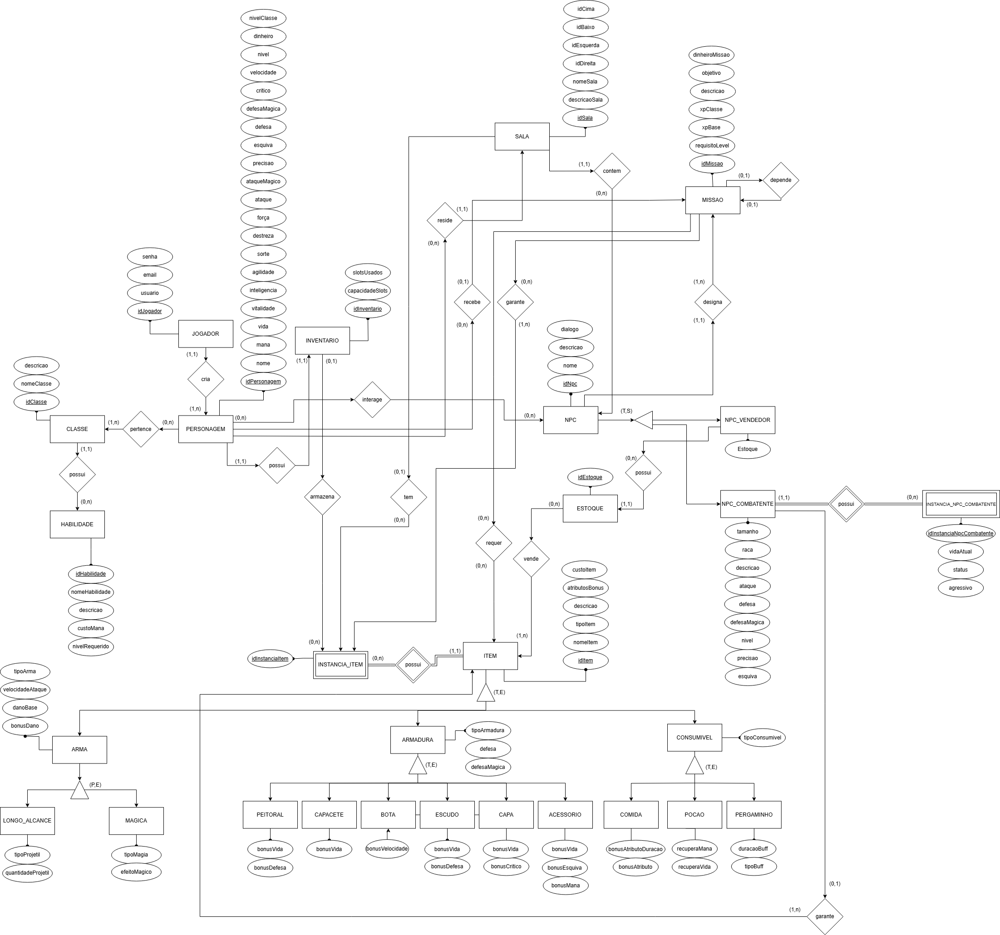
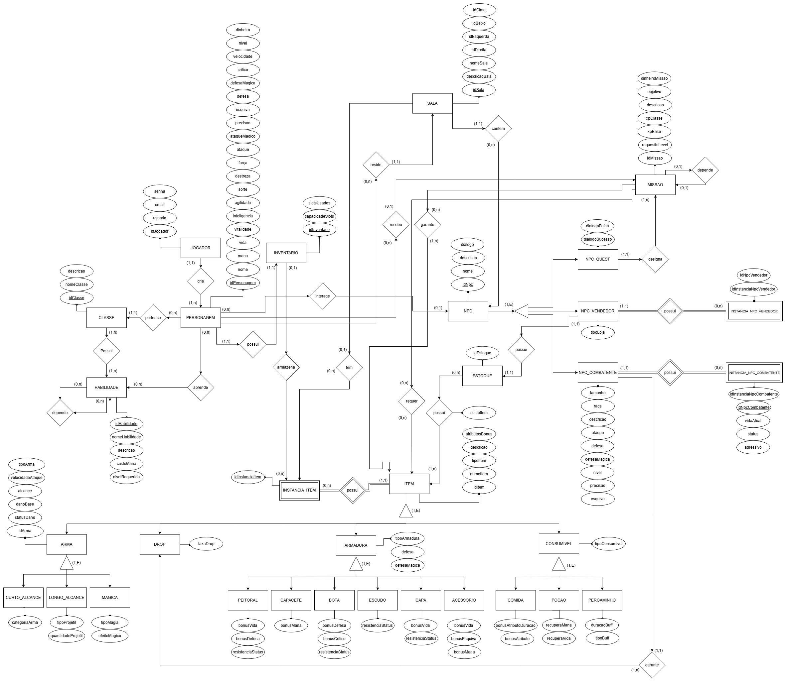

---

---

# DER - Diagrama Entidade-Relacionamento

O **Diagrama de Entidade-Relacionamento** (DER) é uma representação gráfica que tem como objetivo modelar a estrutura lógica de um banco de dados. Ele descreve os dados que serão armazenados e como esses dados se relacionam entre si, servindo como uma etapa fundamental no processo de desenvolvimento de sistemas. 

O DER criado para o nosso jogo *Ragnarok - MUD* é representado abaixo, com suas respectivas versões.

## Versão Atualizada: DER

    <strong>Figura 2:</strong> DER 2.0 - Ragnarok

    <strong>Fonte:</strong> Autores

- Pela extensão do diagrama, recomenda-se abrir o arquivo **[PDF](../../static/img/DERv2.0-Ragnarok.pdf)** do DER.

 
    <b>Versão 1:</b>
    Diagrama de Entidade Relacionamento

    <strong>Figura 1:</strong> DER 1.0 - Ragnarok

    <strong>Fonte:</strong> Autores

## Histórico de Versão

|  Versão  |     Data     | Descrição | Autor(es) | Revisor(es) |
| :------: | :----------: | :-----------: | :---------: | :---------: |
| `1.0` | 29/04/2025 | Criação de documento | [Danilo Naves](https://github.com/DaniloNavesS) | [Cauã Araujo](https://github.com/caua08) |
| `1.1` | 01/05/2025 | Primeira versão de entrega - DER | [Cauã Araujo](https://github.com/caua08), [Danilo Naves](https://github.com/DaniloNavesS), [Ian Costa](https://github.com/iancostag),  [Kauã Richard](https://github.com/rich4rd1)| [Amanda Cruz](https://github.com/mandicrz), [Felipe Motta](https://github.com/M0tt1nh4) |
| `1.2` | 02/05/2025 | Correção no diagrama e na padronização do documento | [Amanda Cruz](https://github.com/mandicrz), [Felipe Motta](https://github.com/M0tt1nh4), [Cauã Araujo](https://github.com/caua08) | [Ian Costa](https://github.com/iancostag) |
| `2.0` | 10/06/2025 | Segunda versão do DER | [Amanda Cruz](https://github.com/mandicrz), [Felipe Motta](https://github.com/M0tt1nh4), [Cauã Araujo](https://github.com/caua08), [Ian Costa](https://github.com/iancostag) | [Kauã Richard](https://github.com/rich4rd1) |
| `2.1` | 14/06/2025 | Correções finais e adição de PDF | [Amanda Cruz](https://github.com/mandicrz) | [Kauã Richard](https://github.com/rich4rd1) |

