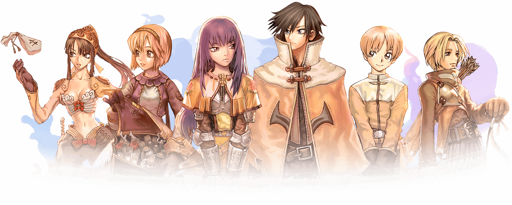

---

---

# 2025.1-Ragnarok



## Jogo

Em Ragnarok MUD, você é transportado para o vasto e místico mundo de Rune-Midgard, um universo repleto de aventuras, magia, monstros e batalhas épicas. Inspirado no clássico MMORPG Ragnarok Online, este projeto recria a essência do jogo em um ambiente Multi-User Dungeon (MUD) — uma experiência textual imersiva onde cada comando, cada decisão e cada linha digitada pode significar a diferença entre a glória e a derrota.

Você assume o papel de um aventureiro que desperta em uma terra dividida por guerras entre reinos, ameaçada por criaturas ancestrais e movida pela eterna busca por poder, conhecimento e redenção.

## Como o jogo funciona?

Ragnarok MUD é uma aventura de interpretação em tempo real, baseada em texto, onde você interage com o mundo digitando comandos e explorando salas interligadas, como cidades, florestas, masmorras e templos antigos.

Você pode criar personagens de diferentes classes — como Espadachins, Magos, Arqueiros e Gatunos — cada uma com habilidades únicas que influenciam diretamente seu estilo de jogo. Conforme avança, seu personagem pode evoluir de classe, aprender novas habilidades e conquistar itens lendários.

O sistema de combate envolve estratégia, uso inteligente de habilidades e o domínio do tempo de reação. Além disso, NPCs, monstros e até outros jogadores povoam o mundo, proporcionando uma experiência dinâmica e desafiadora.

Itens, armas, magias, status e regiões foram inspirados diretamente nas mecânicas do jogo original, mas reimaginados para o formato MUD, priorizando a narrativa, imersão e liberdade total de ação.

A exploração é guiada por descrições ricas em texto e comandos simples que permitem se mover, lutar, coletar e interagir com o mundo ao seu redor. Cada sala, missão ou encontro traz uma nova chance de ganhar experiência, desbloquear segredos e marcar seu nome na história de Rune-Midgard.

## Como Jogar?

Passo a passo para jogar ***Ragnarok* - MUD** :

### 1. Instalação

Guia de Inicialização Rápida: Seu Jogo com PostgreSQL e Python

Este guia detalha os passos para configurar e iniciar o ambiente de desenvolvimento para o seu projeto de jogo, que utiliza PostgreSQL como banco de dados e Python para a lógica. O ambiente é gerenciado via Docker Compose, garantindo portabilidade e facilidade de configuração.

### 2. Pré-requisitos

Docker Desktop (para Windows/macOS) ou Docker Engine e Docker Compose (para Linux): Essencial para rodar o banco de dados em um container.

`Python 3.8+`: A linguagem principal do projeto.
`pip`: Gerenciador de pacotes do Python (geralmente vem com o Python).
`make`: Utilizado para orquestrar os comandos Docker Compose de forma conveniente.

### 3. Configuração de banco de dados

Após clonar o repositorio, entre na pasta `projeto`:

```shell
cd projeto
```

- Rode o comando `make help` para informações adicionais de comandos para rodar o container docker facilmente.

1. Rode o comando para baixar o container PostGres

```shell
make build
```

2. Após isso, suba o container com:

```shell
make up
```

3. Verifique o status do container:

```shell
make logs
```

### 4. Configuração da aplicação

1. Crie um ambiente virtual

```shell
python -m venv .venv
```
2. Ative o ambiente criado no passo anterior:
```shell
source .venv/bin/activate
```
3. Instale as dependencias necessárias

```shell
pip install -r requirements.txt
```

### 5. Inciar o Jogo

Rode o script `main.py`:

```shell
cd app
python3 main.py
```

## Apresentações

| Módulo | Link da gravação | Data |
| :----: | :--------------: | :--: |
|   1    | [Apresentação 1](https://youtu.be/0g3IyhfRMTM?si=ifjVauHRSVdq8QY1) | 02/05/2025 |
|   2    | [Apresentação 2](https://youtu.be/2gFcsBq5W94?si=N_eF2v--Jv4oSN0B) | 16/06/2025 |

## Entregas

- **Módulo 1**
    - [Modelo Entidade-Relacionamento](../docs/entrega_1/MER.md)
    - [Diagrama Entidade-Relacionamento](../docs/entrega_1/DER.md)
    - [Dicionário de Dados](../docs/entrega_1/DD.md)
    - [Modelo Relacional](../docs/entrega_1/MREL.md)

- **Módulo 2**
    - [Modelo Entidade-Relacionamento - ATUALIZAÇÃO](../docs/entrega_1/MER.md)
    - [Diagrama Entidade-Relacionamento - ATUALIZAÇÃO](../docs/entrega_1/DER.md)
    - [Dicionário de Dados - ATUALIZAÇÃO](../docs/entrega_1/DD.md)
    - [Modelo Relacional - ATUALIZAÇÃO](../docs/entrega_1/MREL.md)
    - [Data Definition Language](../docs/entrega_2/ddl.md)
    - [Data Manipulation Language](../docs/entrega_2/dml.md)
    - [Data Query Language](../docs/entrega_2/dql.md)
    - [Álgebra Relacional](../docs/entrega_2/algebra_relacional.md)

- **Módulo 3**

## Equipe

<div class="md-typeset__scrollwrap"><div class="md-typeset__table"><table>
    <tbody><tr>
        <td align="center"><a href="https://github.com/mandicrz"><br /><sub><b>Amanda Cruz Lima</b></sub></a><br /><a href="https://github.com/mandicrz"></a></td>
        <td align="center"><a href="https://github.com/caua08"><br /><sub><b>Cauã Araujo dos Santos</b></sub></a><br /><a href="https://github.com/caua08"></a></td>
        <td align="center"><a href="https://github.com/DaniloNavesS"><br /><sub><b>Danilo Naves</b></sub></a><br /><a href="https://github.com/DaniloNavesS"></a></td>
        <td align="center"><a href="https://github.com/M0tt1nh4"><br /><sub><b>Felipe Motta</b></sub></a><br /><a href="https://github.com/M0tt1nh4"></a></td>
        <td align="center"><a href="https://github.com/iancostag"><br /><sub><b>Ian Costa</b></sub></a><br /><a href="https://github.com/iancostag"></a></td>
        <td align="center"><a href="https://github.com/rich4rd1"><br /><sub><b>Kauã Richard</b></sub></a><br /><a href="https://github.com/rich4rd1"></a></td>
    </tr> 
</tbody></table></div></div> 


